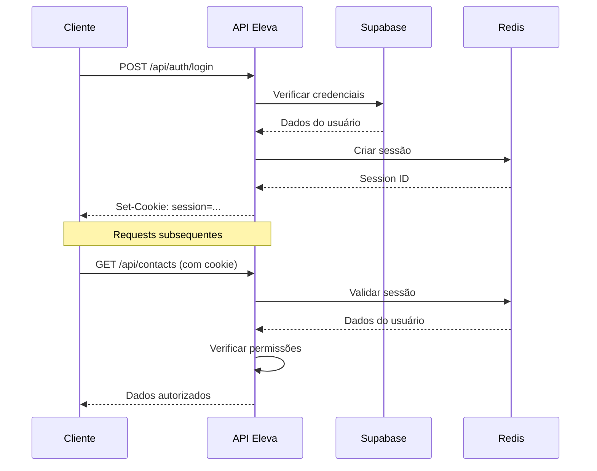

# Autenticação da API

O Eleva AI utiliza um sistema híbrido de autenticação baseado em **cookies de sessão seguros** com **JWT tokens** para integração com APIs externas.

## 🔐 Visão Geral do Sistema

### Fluxo de Autenticação



### Componentes do Sistema

<CardGroup cols={2}>
  <Card title="Session Management" icon="clock">
    - Cookies seguros HTTPOnly
    - Expiração automática
    - Invalidação por logout
    - IP tracking para segurança
  </Card>
  
  <Card title="Access Control" icon="shield-alt">
    - RBAC: user/admin/superadmin
    - Instance-level permissions
    - Account isolation (multi-tenant)
    - API rate limiting
  </Card>
</CardGroup>

## 🚀 Login e Logout

### Fazer Login

<ParamField path="POST /api/auth/login" type="endpoint">
  Autentica usuário e cria sessão segura
</ParamField>

**Request**:
```json
{
  "email": "usuario@empresa.com",
  "password": "senha-segura"
}
```

**Response Success (200)**:
```json
{
  "data": {
    "user": {
      "id": "uuid",
      "email": "usuario@empresa.com",
      "name": "João Silva",
      "role": "admin",
      "accountId": "account-uuid"
    },
    "token": "optional-jwt-token"
  },
  "message": "Login realizado com sucesso"
}
```

**Response Error (401)**:
```json
{
  "error": "Email ou senha inválidos"
}
```

### Fazer Logout

<ParamField path="POST /api/auth/logout" type="endpoint">
  Invalida sessão atual
</ParamField>

**Headers**:
```
Cookie: session=valor-da-sessao
```

**Response (200)**:
```json
{
  "message": "Logout realizado com sucesso"
}
```

### Verificar Sessão

<ParamField path="GET /api/auth/check" type="endpoint">
  Valida se sessão está ativa
</ParamField>

**Response (200)**:
```json
{
  "authenticated": true,
  "user": {
    "id": "uuid",
    "email": "usuario@empresa.com",
    "role": "admin"
  }
}
```

## 🛡️ Sistema de Permissões

### Níveis de Acesso (RBAC)

<Tabs>
  <Tab title="user">
    **Permissões**:
    - Visualizar próprias conversas
    - Gerenciar tarefas atribuídas
    - Acessar instâncias autorizadas
    - Não pode criar/deletar usuários
    
    **Endpoints permitidos**:
    - `/api/conversations` (própria account)
    - `/api/tasks` (próprias tarefas)
    - `/api/contacts` (instâncias autorizadas)
  </Tab>
  
  <Tab title="admin">
    **Permissões**:
    - Gerenciar usuários da própria conta
    - Configurar instâncias WhatsApp
    - Acessar todas as conversas da conta
    - Configurações avançadas de IA
    
    **Endpoints adicionais**:
    - `/api/account/users`
    - `/api/instances/create`
    - `/api/assistant-config/*`
  </Tab>
  
  <Tab title="superadmin">
    **Permissões**:
    - Acesso total ao sistema
    - Gerenciar múltiplas contas
    - Configurar sistema de federação
    - Debug e monitoring avançado
    
    **Endpoints exclusivos**:
    - `/api/superadmin/*`
    - `/api/debug/*`
    - `/api/admin/*`
  </Tab>
</Tabs>

### Instance-Level Access Control

Cada usuário só pode acessar instâncias WhatsApp específicas:

```typescript
// Middleware de validação automática
async function validateInstanceAccess(instanceName: string) {
  const user = await getCurrentUser()
  const hasAccess = await validateUserInstanceAccess(instanceName)
  
  if (!hasAccess && !isSuperAdmin(user)) {
    throw new Error('Access denied to instance')
  }
}
```

**Exemplo de controle**:
```json
// Usuario A só acessa:
{
  "authorizedInstances": ["clinica-abc", "clinica-def"],
  "account_id": "account-123"
}

// Usuario B (outra conta) só acessa:
{
  "authorizedInstances": ["empresa-xyz"],
  "account_id": "account-456"  
}
```

## 🔧 Integração com APIs

### Usando Cookie de Sessão (Recomendado)

Para chamadas browser/frontend:

```javascript
// Fetch com cookies automáticos
const response = await fetch('/api/conversations', {
  credentials: 'include' // Inclui cookies automaticamente
})

// Axios com cookies
axios.defaults.withCredentials = true
const response = await axios.get('/api/conversations')
```

### Usando JWT Token (APIs externas)

Para integrações server-to-server:

```bash
# Obter token no login
TOKEN=$(curl -X POST /api/auth/login \
  -d '{"email":"user@example.com","password":"pass"}' \
  -H "Content-Type: application/json" \
  | jq -r '.data.token')

# Usar token em requests
curl -H "Authorization: Bearer $TOKEN" \
  /api/conversations
```

## 🔒 Middleware de Segurança

### getCurrentUser()

Utilitário principal para verificar autenticação:

```typescript
import { getCurrentUser } from '@/lib/auth-utils-local'

export async function GET(request: Request) {
  // Verificação automática de sessão
  const user = await getCurrentUser()
  
  if (!user) {
    return Response.json({ error: 'Unauthorized' }, { status: 401 })
  }
  
  // User está autenticado
  console.log('User:', user.email, 'Role:', user.role)
}
```

### validateUserInstanceAccess()

Controle de acesso a instâncias:

```typescript
import { validateUserInstanceAccess } from '@/lib/auth-utils'

export async function GET(request: Request) {
  const instanceName = searchParams.get('instance')
  
  const accessCheck = await validateUserInstanceAccess(instanceName)
  
  if (!accessCheck.hasAccess) {
    return Response.json({ error: 'Access denied' }, { status: 403 })
  }
  
  // Acesso autorizado para a instância
}
```

### isSuperAdmin()

Verificação de permissões administrativas:

```typescript
import { isSuperAdmin } from '@/lib/auth-utils'

export async function DELETE(request: Request) {
  const isSuper = await isSuperAdmin()
  
  if (!isSuper) {
    return Response.json({ error: 'Insufficient privileges' }, { status: 403 })
  }
  
  // Operação administrativa autorizada
}
```

## ⚙️ Configuração de Sessões

### Variáveis de Ambiente

```bash
# Chave de criptografia (OBRIGATÓRIO)
SESSION_SECRET=sua-chave-super-secreta-de-32-chars-ou-mais

# Configurações Redis para sessões
REDIS_URL=redis://localhost:6379

# TTL padrão das sessões (opcional)
SESSION_TTL=86400  # 24 horas em segundos
```

### Configurações de Cookie

As sessões usam cookies seguros com as seguintes configurações:

```typescript
const cookieOptions = {
  name: 'session',
  httpOnly: true,        // Previne XSS
  secure: true,          // HTTPS apenas em produção
  sameSite: 'lax',       // Proteção CSRF
  maxAge: 24 * 60 * 60,  // 24 horas
  path: '/'
}
```

## 🔍 Monitoring e Auditoria

### Audit Log

Todas as operações críticas são logadas:

```sql
-- Tabela audit_log
CREATE TABLE audit_log (
  id UUID PRIMARY KEY,
  user_id UUID REFERENCES users(id),
  action VARCHAR NOT NULL,         -- 'user.login', 'task.create', etc.
  resource_type VARCHAR NOT NULL,  -- 'session', 'task', 'message', etc.
  resource_id VARCHAR,
  details JSONB,                   -- IP, user_agent, etc.
  created_at TIMESTAMPTZ DEFAULT NOW()
);
```

**Exemplos de eventos auditados**:
- Login/logout de usuários
- Criação/modificação de tarefas
- Mudanças de configuração
- Acesso a dados sensíveis

### Session Tracking

Informações rastreadas por sessão:

```json
{
  "user_id": "uuid",
  "email": "user@example.com", 
  "role": "admin",
  "ip_address": "192.168.1.100",
  "user_agent": "Mozilla/5.0...",
  "created_at": "2024-09-03T10:00:00Z",
  "last_activity": "2024-09-03T10:30:00Z"
}
```

## 🚨 Troubleshooting de Autenticação

### Problemas Comuns

<Accordion title="Sessão expira muito rápido" icon="clock">

**Causa**: TTL muito baixo ou Redis reiniciando

**Solução**:
```bash
# Verificar TTL das chaves de sessão
redis-cli TTL "session:uuid-da-sessao"

# Aumentar TTL se necessário
SESSION_TTL=86400  # 24 horas
```

</Accordion>

<Accordion title="403 Forbidden em endpoints permitidos" icon="ban">

**Causa**: Usuário não tem acesso à instância solicitada

**Diagnóstico**:
```bash
# Verificar permissões do usuário
curl -X GET /api/me/permissions \
  -H "Cookie: session=valor-sessao"

# Verificar instâncias autorizadas
curl -X GET /api/me/instances \
  -H "Cookie: session=valor-sessao"
```

</Accordion>

<Accordion title="Login funciona mas requests falham" icon="exclamation-triangle">

**Causa**: Cookies não estão sendo enviados

**Soluções**:
1. **Frontend**: Usar `credentials: 'include'` no fetch
2. **CORS**: Verificar se `withCredentials` está habilitado
3. **Domain**: Verificar se cookie domain está correto
4. **HTTPS**: Em produção, cookies secure precisam de HTTPS

</Accordion>

### Debug de Autenticação

```bash
# Verificar sessões ativas no Redis
redis-cli KEYS "session:*" | head -10

# Ver detalhes de uma sessão
redis-cli GET "session:uuid-da-sessao"

# Verificar usuário atual via API
curl -X GET /api/auth/check \
  -H "Cookie: session=valor-sessao" \
  -v  # Ver headers detalhados
```

## 📋 Checklist de Implementação

Para implementar autenticação em novos endpoints:

<Steps>
  <Step title="Adicionar Verificação de Usuário">
    ```typescript
    const user = await getCurrentUser()
    if (!user) return unauthorizedResponse()
    ```
  </Step>
  
  <Step title="Validar Permissões de Role">
    ```typescript
    if (user.role !== 'admin') return forbiddenResponse()
    // ou usar isSuperAdmin() para operações críticas
    ```
  </Step>
  
  <Step title="Verificar Acesso a Instância (se aplicável)">
    ```typescript
    const hasAccess = await validateUserInstanceAccess(instanceName)
    if (!hasAccess) return forbiddenResponse()
    ```
  </Step>
  
  <Step title="Implementar Rate Limiting">
    ```typescript
    await rateLimitByUser(user.id, { window: '1m', limit: 60 })
    ```
  </Step>
  
  <Step title="Adicionar Audit Log (operações críticas)">
    ```typescript
    await createAuditLog(user.id, 'action.performed', {
      resource_type: 'resource',
      resource_id: 'id',
      details: { ip, user_agent }
    })
    ```
  </Step>
</Steps>

---

<Info>
O sistema de autenticação foi projetado para alta segurança mantendo simplicidade de uso. Sempre valide permissões em cada endpoint e use HTTPS em produção.
</Info>