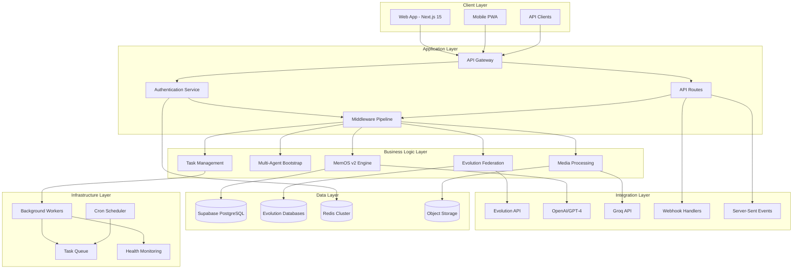
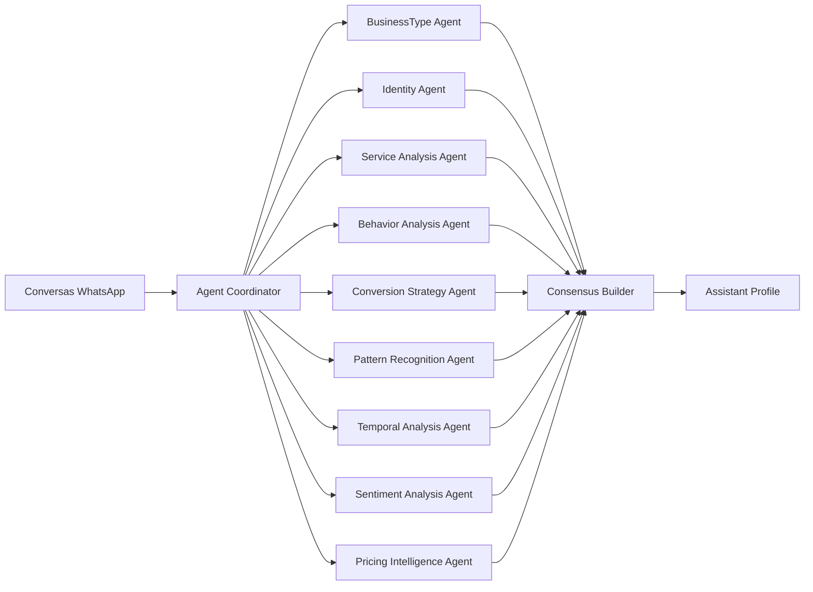

# Arquitetura do Sistema

O Eleva AI é construído sobre uma arquitetura moderna e escalável que combina Next.js 15, PostgreSQL, Redis e inteligência artificial avançada para criar uma plataforma robusta de automação WhatsApp.

## Visão Geral da Arquitetura



## Stack Tecnológico

### Frontend
- **Next.js 15**: Framework React com App Router e Turbopack
- **React 19**: Biblioteca de interface com Server Components
- **TypeScript**: Tipagem estática para maior confiabilidade
- **Tailwind CSS v4**: Estilização com design system
- **Shadcn-ui**: Componentes de interface reutilizáveis

### Backend
- **Node.js**: Runtime JavaScript/TypeScript
- **Next.js API Routes**: Endpoints RESTful nativos
- **Zod**: Validação de esquemas e tipos
- **PostgreSQL**: Banco de dados principal (Supabase)
- **Redis**: Cache distribuído e sessões

### Inteligência Artificial
- **OpenAI GPT-4**: Processamento de linguagem natural
- **Groq**: Transcrição de áudio de alta performance  
- **Embeddings**: Busca semântica com vetorização
- **Multi-Agent System**: 9 agentes especializados

### Infraestrutura
- **Docker**: Containerização da aplicação
- **Vercel/Railway**: Deploy e hosting
- **Object Storage**: Armazenamento de mídia (S3-compatible)
- **Evolution API**: Integração WhatsApp Business

## Componentes Principais

### 1. MemOS v2 (Memory Operating System)

<Tabs>
  <Tab title="Arquitetura">
    ```typescript
    interface MemOSPipeline {
      enrichment: MemoryEnrichmentService
      persistence: MemoryPersistenceService
      retrieval: MemoryRetrievalService
      garbageCollection: MemoryGCService
      workingMemory: WorkingMemoryBuffer
    }
    ```
  </Tab>
  
  <Tab title="Fluxo de Dados">
    1. **Input**: Mensagens WhatsApp chegam via webhook
    2. **Enrichment**: IA extrai informações contextuais
    3. **Persistence**: Memórias são salvas com embeddings
    4. **Retrieval**: Busca semântica para contexto
    5. **GC**: Limpeza automática de memórias de baixa qualidade
  </Tab>
  
  <Tab title="Performance">
    - **Throughput**: 50k+ mensagens/dia
    - **Latency**: <200ms p95 para processamento
    - **Accuracy**: >95% na extração de entidades
    - **Token Reduction**: 30-50% de economia
  </Tab>
</Tabs>

### 2. Sistema de Federação Evolution

O sistema de federação gerencia múltiplos bancos Evolution de forma transparente:

```typescript
interface FederationConfig {
  primary: EvolutionDatabase
  secondary?: EvolutionDatabase
  loadBalancing: 'round-robin' | 'weighted'
  failover: {
    enabled: boolean
    timeout: number
    retries: number
  }
}
```

**Características**:
- **Multi-tenant**: Isolamento seguro entre clientes
- **Load Balancing**: Distribuição inteligente de carga
- **Failover Automático**: Recuperação transparente de falhas
- **Query Routing**: Direcionamento otimizado de consultas

### 3. Background Workers

<CardGroup cols={2}>
  <Card title="Audio Transcription Worker" icon="microphone">
    Processa mensagens de áudio usando Groq API
    - Queue: `audio-transcription`
    - Concurrency: 5 workers
    - Retry: Exponential backoff
  </Card>
  
  <Card title="Visual Analysis Worker" icon="eye">
    Analisa imagens usando OpenAI Vision
    - Queue: `visual-analysis` 
    - Concurrency: 3 workers
    - Timeout: 30s per image
  </Card>
  
  <Card title="Task Processing Worker" icon="robot">
    Executa tarefas programadas automaticamente
    - Queue: `task-processing`
    - Scheduler: Cron-based
    - Priority: Alta/Média/Baixa
  </Card>
  
  <Card title="PDF Processing Worker" icon="file-pdf">
    Extrai e resume documentos PDF
    - Queue: `pdf-processing`
    - OCR: Tesseract.js
    - AI Summary: GPT-4
  </Card>
</CardGroup>

### 4. Sistema Multi-Agente Bootstrap

Sistema de análise inteligente que constrói perfis de assistente automaticamente:



## Padrões de Design

### 1. Federation Pattern
Abstrai complexidade de múltiplos bancos Evolution:

```typescript
// Uso transparente - escolhe automaticamente o banco correto
const result = await queryByInstance(instanceId, query, params)

// Configuração da API Evolution
const config = await getInstanceApiConfig(instanceName)
```

### 2. Pipeline Pattern
MemOS processa dados em estágios:

```typescript
const pipeline = new MemOSPipeline()
  .stage(MemoryEnrichment)
  .stage(EntityExtraction) 
  .stage(EmbeddingGeneration)
  .stage(Persistence)
```

### 3. Worker Pattern
Background jobs com retry e monitoramento:

```typescript
class AudioTranscriptionWorker extends BaseWorker {
  async process(job: AudioJob): Promise<TranscriptionResult> {
    // Implementação com retry automático
  }
}
```

### 4. Event-Driven Pattern
Comunicação assíncrona entre componentes:

```typescript
// Eventos em tempo real
eventEmitter.emit('message.received', { messageData })
eventEmitter.emit('task.completed', { taskId, result })
eventEmitter.emit('ai.processing.started', { contactId })
```

## Segurança e Autenticação

### Camadas de Segurança

<Steps>
  <Step title="Autenticação de Sessão">
    Sistema baseado em cookies seguros com JWT tokens
  </Step>
  
  <Step title="Validação de Entrada">
    Todos os endpoints usam Zod para validação rigorosa
  </Step>
  
  <Step title="Controle de Acesso">
    RBAC (Role-Based Access Control) com níveis user/admin/superadmin
  </Step>
  
  <Step title="Isolamento de Dados">
    Multi-tenancy com isolamento por account_id
  </Step>
  
  <Step title="Rate Limiting">
    Proteção contra abuse com Redis-based throttling
  </Step>
</Steps>

### Middleware de Segurança

```typescript
// Middleware de autenticação
export async function authMiddleware(req: NextRequest) {
  const user = await getCurrentUser()
  if (!user) return unauthorizedResponse()
  
  // Validação de acesso à instância
  const hasAccess = await validateUserInstanceAccess(instanceName)
  if (!hasAccess) return forbiddenResponse()
}
```

## Performance e Escalabilidade

### Otimizações Implementadas

<Accordion title="Cache Strategy" icon="database">
- **Redis Cluster**: Cache distribuído para dados frequentes
- **TTL Inteligente**: Expiração baseada em padrões de uso
- **Cache Warming**: Pre-carregamento de dados críticos
- **Invalidation**: Limpeza automática quando dados mudam
</Accordion>

<Accordion title="Database Optimization" icon="server">
- **Connection Pooling**: Pool de conexões otimizado
- **Query Optimization**: Índices estratégicos e queries eficientes  
- **Read Replicas**: Separação read/write para Evolution DBs
- **Batch Operations**: Processamento em lote para operações massivas
</Accordion>

<Accordion title="AI Optimization" icon="brain">
- **Token Management**: Redução de 30-50% no uso de tokens
- **Model Selection**: Groq para speed, OpenAI para accuracy
- **Confidence Thresholds**: Execução apenas de operações confiáveis
- **Embedding Cache**: Vetores reutilizados para consultas similares
</Accordion>

<Accordion title="Frontend Optimization" icon="window">
- **Turbopack**: Build ultra-rápido em desenvolvimento
- **Server Components**: Renderização server-side otimizada
- **Code Splitting**: Carregamento sob demanda de componentes
- **SSE**: Updates em tempo real sem polling
</Accordion>

## Monitoramento e Observabilidade

### Métricas Coletadas

<CardGroup cols={2}>
  <Card title="Business Metrics">
    - Conversas processadas/dia
    - Taxa de conversão de leads
    - Tempo médio de resposta
    - Tarefas executadas automaticamente
  </Card>
  
  <Card title="Technical Metrics">  
    - Latência de API (p50, p95, p99)
    - Error rate por endpoint
    - Queue depth dos workers
    - Cache hit ratio
  </Card>
  
  <Card title="AI Metrics">
    - Confidence scores médios
    - Token usage por modelo
    - Processing time por tipo de mídia
    - Memory quality scores
  </Card>
  
  <Card title="Infrastructure Metrics">
    - CPU/Memory usage
    - Database connection pool
    - Redis memory usage
    - Storage utilization
  </Card>
</CardGroup>

### Health Checks

O sistema implementa health checks em múltiplas camadas:

```typescript
// Health check endpoint
GET /api/health
{
  "status": "healthy",
  "checks": {
    "database": "ok",
    "redis": "ok", 
    "evolution": "ok",
    "workers": "ok",
    "ai_services": "ok"
  },
  "uptime": "72h:35m:12s"
}
```

## Próximos Passos na Arquitetura

<CardGroup cols={2}>
  <Card title="Microservices Migration" icon="cubes">
    Separação gradual em microserviços especializados
  </Card>
  
  <Card title="GraphQL Layer" icon="share-alt">
    API GraphQL para queries mais eficientes
  </Card>
  
  <Card title="Event Sourcing" icon="stream">
    Log de eventos para auditoria completa
  </Card>
  
  <Card title="Global CDN" icon="globe">
    Distribuição global de assets estáticos
  </Card>
</CardGroup>

---

<Info>
Esta arquitetura foi projetada para suportar milhares de conversas simultâneas enquanto mantém baixa latência e alta confiabilidade.
</Info>