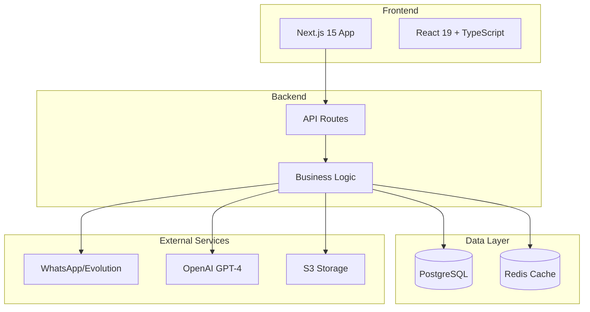

# Eleva AI - Plataforma de Automação WhatsApp Business

## Transforme conversas em oportunidades com Inteligência Artificial

Eleva AI é uma plataforma empresarial que automatiza e otimiza o atendimento via WhatsApp Business, utilizando inteligência artificial avançada para gerenciar leads, criar tarefas automaticamente e processar documentos.

<CardGroup cols={2}>
  <Card
    title="Início Rápido"
    icon="rocket"
    href="/eleva-ai/quickstart"
  >
    Configure e execute em menos de 5 minutos
  </Card>
  <Card
    title="API Reference"
    icon="code"
    href="/eleva-ai/api/introduction"
  >
    Documentação completa da API REST
  </Card>
  <Card
    title="Arquitetura"
    icon="diagram-project"
    href="/eleva-ai/architecture/overview"
  >
    Entenda como o sistema funciona
  </Card>
  <Card
    title="Guias"
    icon="book"
    href="/eleva-ai/guides/deployment"
  >
    Tutoriais e melhores práticas
  </Card>
</CardGroup>

## 🎯 Para quem é o Eleva AI?

<AccordionGroup>
  <Accordion title="Clínicas e Consultórios" icon="hospital">
    - Agendamento automatizado de consultas
    - Confirmação de presença
    - Envio de lembretes
    - Triagem inicial de pacientes
  </Accordion>
  
  <Accordion title="E-commerce e Varejo" icon="shopping-cart">
    - Atendimento 24/7
    - Acompanhamento de pedidos
    - Suporte pós-venda
    - Recuperação de carrinho abandonado
  </Accordion>
  
  <Accordion title="Prestadores de Serviços" icon="briefcase">
    - Orçamentos automatizados
    - Qualificação de leads
    - Follow-up inteligente
    - Gestão de agenda
  </Accordion>
  
  <Accordion title="Educação" icon="graduation-cap">
    - Matrículas e rematrículas
    - Suporte ao aluno
    - Envio de material didático
    - Comunicação com responsáveis
  </Accordion>
</AccordionGroup>

## 💡 Principais Recursos

### 🤖 Processamento Inteligente com IA

<Tabs>
  <Tab title="Análise de Conversas">
    - **GPT-4 Integration**: Compreensão avançada de contexto
    - **Extração de Entidades**: Nome, telefone, preferências
    - **Análise de Sentimento**: Detecta urgência e satisfação
    - **Resumos Automáticos**: Síntese de conversas longas
  </Tab>
  
  <Tab title="Multi-Agent System">
    - **9 Agentes Especializados**: Análise completa do negócio
    - **Identificação de Padrões**: Comportamento e preferências
    - **Estratégias de Conversão**: Técnicas personalizadas
    - **Bootstrap Automático**: Configuração inteligente
  </Tab>
  
  <Tab title="Processamento de Mídia">
    - **OCR Avançado**: Extração de texto de imagens
    - **Análise de PDFs**: Resumo e extração de dados
    - **Transcrição de Áudio**: Converte voz em texto
    - **Análise Visual**: Compreende conteúdo de imagens
  </Tab>
</Tabs>

### 📊 Gestão e Automação

<CardGroup cols={3}>
  <Card title="Multi-instâncias" icon="layer-group">
    Gerencie múltiplas contas WhatsApp em uma única interface
  </Card>
  
  <Card title="Tarefas Automáticas" icon="robot">
    Criação e execução de follow-ups baseados em regras
  </Card>
  
  <Card title="Workers 24/7" icon="clock">
    Processamento contínuo em background
  </Card>
  
  <Card title="Classificação de Leads" icon="users">
    Categorização automática: lead, cliente, perdido
  </Card>
  
  <Card title="Métricas em Tempo Real" icon="chart-line">
    Dashboard com KPIs e análises
  </Card>
  
  <Card title="Cache Inteligente" icon="database">
    Redis para alta performance
  </Card>
</CardGroup>

## 🏗️ Arquitetura Técnica

## 📈 Resultados Esperados

<Steps>
  <Step title="Redução de 70% no tempo de resposta">
    Respostas automáticas e sugestões inteligentes aceleram o atendimento
  </Step>
  
  <Step title="Aumento de 40% na conversão">
    Follow-ups automáticos e no momento certo aumentam as vendas
  </Step>
  
  <Step title="3x mais produtividade">
    Automação libera equipe para atividades estratégicas
  </Step>
  
  <Step title="Disponibilidade 24/7">
    Atendimento contínuo sem aumentar custos operacionais
  </Step>
</Steps>

## 🚀 Comece Agora

<CardGroup cols={2}>
  <Card
    title="Instalação Local"
    icon="download"
    href="/eleva-ai/getting-started/installation"
  >
    Configure seu ambiente de desenvolvimento
  </Card>
  
  <Card
    title="Deploy em Produção"
    icon="cloud"
    href="/eleva-ai/guides/deployment"
  >
    Publique em Vercel ou Docker
  </Card>
</CardGroup>

<Note>
  **Precisa de ajuda?** Entre em contato com nosso suporte técnico ou acesse nossos [guias detalhados](/eleva-ai/guides/troubleshooting).
</Note>

## 📚 Recursos Adicionais

- [Documentação da API](/eleva-ai/api/introduction)
- [Arquitetura do Sistema](/eleva-ai/architecture/overview)
- [Configuração Avançada](/eleva-ai/getting-started/configuration)
- [Troubleshooting](/eleva-ai/guides/troubleshooting)

---

<Info>
  **Versão**: 0.1.0 | **Última Atualização**: Setembro 2024 | **Licença**: Proprietária
</Info>