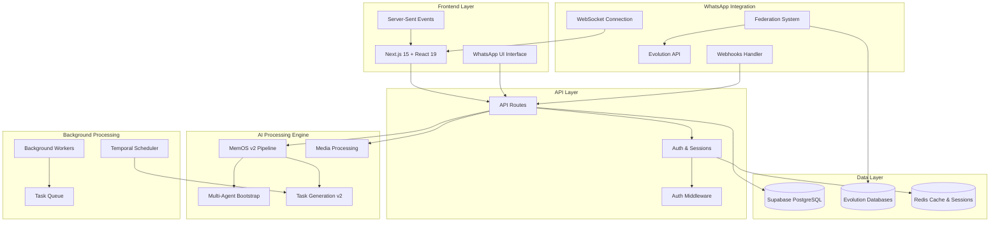

# Eleva AI - Plataforma de Automação WhatsApp Business

## Transforme conversas em oportunidades com Inteligência Artificial

Eleva AI é uma plataforma empresarial que automatiza e otimiza o atendimento via WhatsApp Business, utilizando inteligência artificial avançada para gerenciar leads, criar tarefas automaticamente e processar documentos.

<CardGroup cols={2}>
  <Card
    title="Início Rápido"
    icon="rocket"
    href="/eleva-ai/quickstart"
  >
    Configure e execute em menos de 5 minutos
  </Card>
  <Card
    title="API Reference"
    icon="code"
    href="/eleva-ai/api/introduction"
  >
    Documentação completa da API REST
  </Card>
  <Card
    title="Arquitetura"
    icon="diagram-project"
    href="/eleva-ai/architecture/overview"
  >
    Entenda como o sistema funciona
  </Card>
  <Card
    title="Guias"
    icon="book"
    href="/eleva-ai/guides/deployment"
  >
    Tutoriais e melhores práticas
  </Card>
</CardGroup>

## 🎯 Para quem é o Eleva AI?

<AccordionGroup>
  <Accordion title="Clínicas e Consultórios" icon="hospital">
    - Agendamento automatizado de consultas
    - Confirmação de presença
    - Envio de lembretes
    - Triagem inicial de pacientes
  </Accordion>
  
  <Accordion title="E-commerce e Varejo" icon="shopping-cart">
    - Atendimento 24/7
    - Acompanhamento de pedidos
    - Suporte pós-venda
    - Recuperação de carrinho abandonado
  </Accordion>
  
  <Accordion title="Prestadores de Serviços" icon="briefcase">
    - Orçamentos automatizados
    - Qualificação de leads
    - Follow-up inteligente
    - Gestão de agenda
  </Accordion>
  
  <Accordion title="Educação" icon="graduation-cap">
    - Matrículas e rematrículas
    - Suporte ao aluno
    - Envio de material didático
    - Comunicação com responsáveis
  </Accordion>
</AccordionGroup>

## 💡 Principais Recursos

### 🤖 Sistema MemOS v2 (Memory Operating System)

<Tabs>
  <Tab title="Memória Granular">
    - **Extração Precisa**: Informações específicas com pontuação de confiança
    - **Garbage Collection**: Limpeza automática de memórias de baixa qualidade
    - **Working Memory**: Buffer ativo para conversas em andamento
    - **Embeddings**: Busca semântica inteligente com vetorização
  </Tab>
  
  <Tab title="Sistema Multi-Agente Bootstrap">
    - **9 Agentes Especializados**: BusinessType, Identity, ServiceAnalysis, etc.
    - **Consensus Building**: Fusão inteligente de insights de múltiplos agentes
    - **Quality Metrics**: Completude, consistência e confiabilidade
    - **Auto-Integration**: Integração automática com pipeline MemOS
  </Tab>
  
  <Tab title="Processamento de Mídia IA">
    - **Transcrição com Groq**: Conversão de áudio para texto com alta precisão
    - **Análise Visual OpenAI**: Compreensão de imagens e documentos visuais
    - **PDF Intelligence**: Resumo e extração de dados de documentos
    - **Retry Logic**: Sistema robusto com backoff exponencial
  </Tab>
</Tabs>

### 📊 Gestão e Automação

<CardGroup cols={3}>
  <Card title="Federation System" icon="layer-group">
    Sistema de federação para múltiplos bancos Evolution com load balancing automático
  </Card>
  
  <Card title="Task Generation v2" icon="robot">
    Geração automática de tarefas com análise temporal e confidence scoring
  </Card>
  
  <Card title="Background Workers" icon="clock">
    Workers especializados: audio-transcription, visual-analysis, task-processing
  </Card>
  
  <Card title="Lead Classification" icon="users">
    Classificação automática: lead, patient, lost, company com estágios personalizáveis
  </Card>
  
  <Card title="Real-time Updates" icon="chart-line">
    SSE (Server-Sent Events) para atualizações em tempo real
  </Card>
  
  <Card title="Redis Cache Coordinator" icon="database">
    Sistema avançado de cache com TTL inteligente e invalidação automática
  </Card>
</CardGroup>

## 🏗️ Arquitetura Técnica

## 📈 Resultados Esperados

<Steps>
  <Step title="Redução de 70% no tempo de resposta">
    Respostas automáticas e sugestões inteligentes aceleram o atendimento
  </Step>
  
  <Step title="Aumento de 40% na conversão">
    Follow-ups automáticos e no momento certo aumentam as vendas
  </Step>
  
  <Step title="3x mais produtividade">
    Automação libera equipe para atividades estratégicas
  </Step>
  
  <Step title="Disponibilidade 24/7">
    Atendimento contínuo sem aumentar custos operacionais
  </Step>
</Steps>

## 🚀 Comece Agora

<CardGroup cols={2}>
  <Card
    title="Instalação Local"
    icon="download"
    href="/eleva-ai/getting-started/installation"
  >
    Configure seu ambiente de desenvolvimento
  </Card>
  
  <Card
    title="Deploy em Produção"
    icon="cloud"
    href="/eleva-ai/guides/deployment"
  >
    Publique em Vercel ou Docker
  </Card>
</CardGroup>

<Note>
  **Precisa de ajuda?** Entre em contato com nosso suporte técnico ou acesse nossos [guias detalhados](/eleva-ai/guides/troubleshooting).
</Note>

## 📚 Recursos Adicionais

- [Documentação da API](/eleva-ai/api/introduction)
- [Arquitetura do Sistema](/eleva-ai/architecture/overview)
- [Configuração Avançada](/eleva-ai/getting-started/configuration)
- [Troubleshooting](/eleva-ai/guides/troubleshooting)

---

<Info>
  **Versão**: 0.1.0 | **Última Atualização**: Setembro 2024 | **Licença**: Proprietária
</Info>